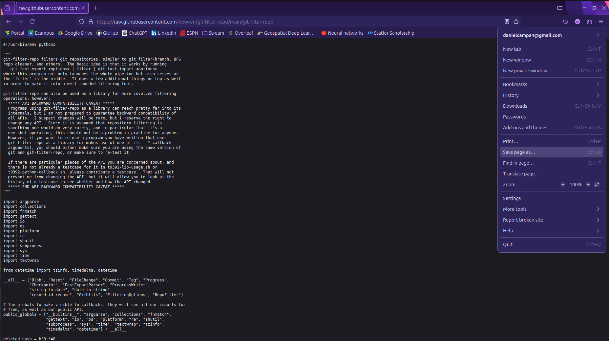
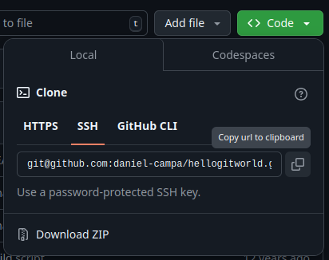

<!-- Improved compatibility of back to top link: See: https://github.com/othneildrew/Best-README-Template/pull/73 -->
<a id="readme-top"></a>
<!--
*** Thanks for checking out the Best-README-Template. If you have a suggestion
*** that would make this better, please fork the repo and create a pull request
*** or simply open an issue with the tag "enhancement".
*** Don't forget to give the project a star!
*** Thanks again! Now go create something AMAZING! :D
-->


<!-- PROJECT SHIELDS -->
<!--
*** I'm using markdown "reference style" links for readability.
*** Reference links are enclosed in brackets [ ] instead of parentheses ( ).
*** See the bottom of this document for the declaration of the reference variables
*** for contributors-url, forks-url, etc. This is an optional, concise syntax you may use.
*** https://www.markdownguide.org/basic-syntax/#reference-style-links
-->
<!--[![Contributors][contributors-shield]][contributors-url]-->
<!--[![Forks][forks-shield]][forks-url]-->
<!--[![Stargazers][stars-shield]][stars-url]-->
<!--[![Issues][issues-shield]][issues-url]-->
<!--[![MIT License][license-shield]][license-url]-->
<!--[![LinkedIn][linkedin-shield]][linkedin-url]-->


<!-- PROJECT LOGO -->
<br />
<div align="center">
  <a href="https://github.com/othneildrew/Best-README-Template">
    
  </a>

  <h3 align="center">How to Permanently Remove a File From Git History</h3>

  <p align="center">
    Using the <code>git-filter-repo</code> tool
    <br />
    <a href="https://htmlpreview.github.io/?https://github.com/newren/git-filter-repo/blob/docs/html/git-filter-repo.html" target="_blank"><strong>Explore the docs »</strong></a>
    <br />
    <br />
    <!--<a href="https://github.com/othneildrew/Best-README-Template">View Demo</a>-->
    <!--·-->
    <!--<a href="https://github.com/othneildrew/Best-README-Template/issues/new?labels=bug&template=bug-report---.md">Report Bug</a>-->
    <!--·-->
    <!--<a href="https://github.com/othneildrew/Best-README-Template/issues/new?labels=enhancement&template=feature-request---.md">Request Feature</a>-->
  </p>
</div>


<!-- TABLE OF CONTENTS -->
<details>
  <summary>Table of Contents</summary>
  <ol>
    <li>
      <a href="#motivation-for-using-git-filter-repo">Motivation</a>
    </li>
    <li>
      <a href="#getting-started">Getting Started</a>
      <ul>
        <li><a href="#prerequisites">Prerequisites</a></li>
        <li><a href="#installation">Installation</a></li>
      </ul>
    </li>
    <li><a href="#usage">Usage</a></li>
    <li><a href="#best-practices-for-avoiding-future-issues">Best Practices</a></li>
    <li><a href="#contact">Contact</a></li>
    <li><a href="#resources">Resources</a></li>
  </ol>
</details>


<!-- ABOUT THE PROJECT -->
## Motivation for using `git-filter-repo`

<!-- [![Product Name Screen Shot][product-screenshot]](https://example.com) -->

When I was new to GitHub I just committed all files and pushed them to remote. Eventually my repository grew to a whopping 15GB. This made it extremely difficult for collaborators to clone my repository. If you have a similar experience then this guide will make your repository useful again.

Here are a few reasons to use `git-filter-repo`:
* Your remote repository is too large
* Most of your repository's size comes from unwanted history tracking
* You have sensitive information in a file (like a password) that needs to be removed from all history

<!-- Use the `BLANK_README.md` to get started. -->

<!-- <p align="right">(<a href="#readme-top">back to top</a>)</p> -->


<!-- ### Built With

This section should list any major frameworks/libraries used to bootstrap your project. Leave any add-ons/plugins for the acknowledgements section. Here are a few examples.

* [![Next][Next.js]][Next-url]
* [![React][React.js]][React-url]
* [![Vue][Vue.js]][Vue-url]
* [![Angular][Angular.io]][Angular-url]
* [![Svelte][Svelte.dev]][Svelte-url]
* [![Laravel][Laravel.com]][Laravel-url]
* [![Bootstrap][Bootstrap.com]][Bootstrap-url]
* [![JQuery][JQuery.com]][JQuery-url]

<p align="right">(<a href="#readme-top">back to top</a>)</p> -->


<!-- GETTING STARTED -->
## Getting Started


### Prerequisites

This guide assumes you have a git repository set up in a Linux or MacOS environment. A package manager may also make installation more simple, but it is not required.

Some basic UNIX commands are used throughout this guide. Visit this [link](https://mally.stanford.edu/~sr/computing/basic-unix.html) if you want to learn more about UNIX commands.

This guide uses code cells when describing a command that you need to run. Note that any words between inequality symbols need to be replaced.
- For example:
  ```sh
  cd <YOUR_DIRECTORY>
  ```
  In this case `<YOUR_DIRECTORY>` should be replaced with an actual directory name.


### Installation

There are two options for installing the `git-filter-repo` tool. If you have a package manager like Homebrew, you can use a comand like `brew install`. If not, proceed to the manual installation.
#### Installing via a package manager
1. Open up a terminal
2. Replace `<PACKAGE_TOOL>` with your package manager.
    ```sh
    <PACKAGE_TOOL> install git-filter-repo
    ```

    Proceed to the <a href="#verifying-installation">Verifying Installation</a> section.

#### Installing without a package manager
1. Access the `git-filter-repo` file by clicking [here](https://raw.githubusercontent.com/newren/git-filter-repo/main/git-filter-repo)
2. Use your browser to save the page as a plain text document named `git-filter-repo`. Pay attention to where you save the file.

1. Locate the file (probably your Downloads folder) and move it to an existing directory for long term storage. Replace `<YOUR_DIRECTORY>` with the name of the directory you want to move this file to.
    ```sh
    mv ~/Downloads/git-filter-repo ~/<YOUR_DIRECTORY>
    ```
2. Add the directory to your `PATH` environment variable so you can execute it from anywhere. Note that only `<YOUR_DIRECTORY>` should be replaced in this command.
    ```sh
    export PATH=$PATH:~/<YOUR_DIRECTORY>
    ```
3. Add execution permissions to the file.
    ```sh
    chmod +x ~/<YOUR_DIRECTORY>/git-filter-repo 
    ```

#### Verifying Installation
*  Run the following command to verify installation.
    ```sh
    git filter-repo --version
    ```
    If you see a hash (e.g. `3b305b7ea73d`), then installation was successful

*  If installation was not successful, try an alternative installation method above.


<!-- USAGE EXAMPLES -->
## Usage

This section assumes you have successfully installed the `git-filter-repo` tool.

1. Locate your repository's information from github.com at your repository's homepage. Copy the SSH link to your clipboard.


1. Create a fresh clone of your repository. Be sure to replace `<OWNER>` and `<REPOSITORY>` with your own information which was found on the previous step
    ```sh
    git clone git@github.com:<OWNER>/<REPOSITORY>.git
    ```
    This may take some time depending on the size of your repository.

    
2. Navigate to your new clone.
    ```sh
    cd <LOCAL_REPOSITORY>
    ```
3. (Optional) The analyze option creates a report listing the sizes of objects and their history in your repository. No changes to the repository are made during this step.
    ```sh
    git filter-repo --analyze
    ```
    * The output of this command tells you where the reports are stored. Usually it's `.git/filter-repo/analysis`.
    * Refer to the `.git/filter-repo/analysis/README` in that directory to interpret the results of the various reports.
4. This step will remove unwanted history <b>_permantently_</b>. There are several options for doing this.
    * <b>Inclusion Filter:</b> This will only keep folders and files that are specified by the arguments, and _remove everything else_. Replace the arguments with your files and folders
      ```sh
      git filter-repo --path <folder-to-keep-1> --path <folder-to-keep-1>
      ```
      Example command:
      ```sh
      git filter-repo --path README.md --path guides/ --path tools/releases/
      ```
      This keeps only the `README.md` file and the `guides` and `tools/releases` directories.

    * <b>Exclusion Filter (`--invert-paths`):</b> This keeps all folders and files except those specified by the arguments.
      ```sh
      git filter-repo --path <file-to-remove> --invert-paths
      ```
      Example command:
      ```sh
      git filter-repo --path large_file.zip --invert-paths
      ```
      This removes the file `large_file.zip` only.
    * Note that if you want to have inclusion and exclusion filters, you can run the command multiple times with different options.
    * For regular expression filters use the `--path-regex` option.
      Example command:
      ```sh
      git filter-repo --path-regex '^.*/.*/[0-9]{4}-[0-9]{2}-[0-9]{2}.txt$'
      ```
    * For more advanced options refer to the `git-filter-repo` [Documentation](https://htmlpreview.github.io/?https://github.com/newren/git-filter-repo/blob/docs/html/git-filter-repo.html).
5. Add the remote origin back to your local repository. Be sure to replace `<OWNER>` and `<REPOSITORY>` with your own information which was found on step 2.
    ```sh
    git remote add origin git@github.com:<OWNER>/<REPOSITORY>.git
    ```
6. Push your local changes.
    ```sh
    git push origin --force --all
    ```
7.  Push again to update tagged releases.
    ```sh
    git push origin --force --tags
    ```
8.  Set the default upstream branch as master or any other branch
    ```sh
    git push --set-upstream origin master
    ```
9.  (Sensitive Data Only) If the data you removed was sensitive, this step is needed to completely remove the data from GitHub.
     * First, you need to submit a request through the [GitHub Support portal](https://support.github.com/).
     * Next, tell your collaborators to rebase instead of merge any branches that stem from the old repository. Merging would reintroduce the removed data.

_For more examples, please refer to the `git-filter-repo` [Documentation](https://htmlpreview.github.io/?https://github.com/newren/git-filter-repo/blob/docs/html/git-filter-repo.html)_


## Best practices for avoiding future issues

Large files (files over 50MB) should not be pushed to a remote GitHub repository. If these files need to be shared with collaborators, it's best to copy them on a case-by-case basis to avoid cluttering the repository. Making use of `.gitignore` files we can choose what to push to the remote repository.

1. Create an empty .gitignore file
    ```sh
    touch .gitignore
    ```
2. Open the file in any text editor and add files or directories that your want to ignore. An example .gitignore file might look like this.
    ```
    large_file.zip
    logs/
    .DS_Store
    *.db
    password.txt
    ```


_For more information check out GitHub's [Ignoring Files](https://docs.github.com/en/get-started/getting-started-with-git/ignoring-files) and [.gitignore examples](https://gist.github.com/octocat/9257657)._


<!-- ROADMAP -->
<!-- ## Roadmap

- [x] Add Changelog
- [x] Add back to top links
- [ ] Add Additional Templates w/ Examples
- [ ] Add "components" document to easily copy & paste sections of the readme
- [ ] Multi-language Support
    - [ ] Chinese
    - [ ] Spanish

See the [open issues](https://github.com/othneildrew/Best-README-Template/issues) for a full list of proposed features (and known issues).

<p align="right">(<a href="#readme-top">back to top</a>)</p>
 -->


<!-- CONTACT -->
## Contact

Daniel Campa - danielcampa4@gmail.com

<!-- Project Link: [https://github.com/your_username/repo_name](https://github.com/your_username/repo_name) -->


<!-- ACKNOWLEDGMENTS -->
## Resources

* [`git-filter-repo` Documentation](https://htmlpreview.github.io/?https://github.com/newren/git-filter-repo/blob/docs/html/git-filter-repo.html)
* [`git-filter-repo` Installation Guide](https://github.com/newren/git-filter-repo/blob/main/INSTALL.md)
* [Removing Sensitive Data From a Repository](https://docs.github.com/en/authentication/keeping-your-account-and-data-secure/removing-sensitive-data-from-a-repository#using-git-filter-repo)
* [Sample Training Repository](https://github.com/githubtraining/hellogitworld)
* [Ignoring Files](https://docs.github.com/en/get-started/getting-started-with-git/ignoring-files)
* [.gitignore examples](https://gist.github.com/octocat/9257657).


<p align="right">(<a href="#readme-top">back to top</a>)</p>


<!-- MARKDOWN LINKS & IMAGES -->
<!-- https://www.markdownguide.org/basic-syntax/#reference-style-links -->
[contributors-shield]: https://img.shields.io/github/contributors/othneildrew/Best-README-Template.svg?style=for-the-badge
[contributors-url]: https://github.com/othneildrew/Best-README-Template/graphs/contributors
[forks-shield]: https://img.shields.io/github/forks/othneildrew/Best-README-Template.svg?style=for-the-badge
[forks-url]: https://github.com/othneildrew/Best-README-Template/network/members
[stars-shield]: https://img.shields.io/github/stars/othneildrew/Best-README-Template.svg?style=for-the-badge
[stars-url]: https://github.com/othneildrew/Best-README-Template/stargazers
[issues-shield]: https://img.shields.io/github/issues/othneildrew/Best-README-Template.svg?style=for-the-badge
[issues-url]: https://github.com/othneildrew/Best-README-Template/issues
[license-shield]: https://img.shields.io/github/license/othneildrew/Best-README-Template.svg?style=for-the-badge
[license-url]: https://github.com/othneildrew/Best-README-Template/blob/master/LICENSE.txt
[linkedin-shield]: https://img.shields.io/badge/-LinkedIn-black.svg?style=for-the-badge&logo=linkedin&colorB=555
[linkedin-url]: https://linkedin.com/in/othneildrew
[product-screenshot]: images/screenshot.png
[Next.js]: https://img.shields.io/badge/next.js-000000?style=for-the-badge&logo=nextdotjs&logoColor=white
[Next-url]: https://nextjs.org/
[React.js]: https://img.shields.io/badge/React-20232A?style=for-the-badge&logo=react&logoColor=61DAFB
[React-url]: https://reactjs.org/
[Vue.js]: https://img.shields.io/badge/Vue.js-35495E?style=for-the-badge&logo=vuedotjs&logoColor=4FC08D
[Vue-url]: https://vuejs.org/
[Angular.io]: https://img.shields.io/badge/Angular-DD0031?style=for-the-badge&logo=angular&logoColor=white
[Angular-url]: https://angular.io/
[Svelte.dev]: https://img.shields.io/badge/Svelte-4A4A55?style=for-the-badge&logo=svelte&logoColor=FF3E00
[Svelte-url]: https://svelte.dev/
[Laravel.com]: https://img.shields.io/badge/Laravel-FF2D20?style=for-the-badge&logo=laravel&logoColor=white
[Laravel-url]: https://laravel.com
[Bootstrap.com]: https://img.shields.io/badge/Bootstrap-563D7C?style=for-the-badge&logo=bootstrap&logoColor=white
[Bootstrap-url]: https://getbootstrap.com
[JQuery.com]: https://img.shields.io/badge/jQuery-0769AD?style=for-the-badge&logo=jquery&logoColor=white
[JQuery-url]: https://jquery.com 